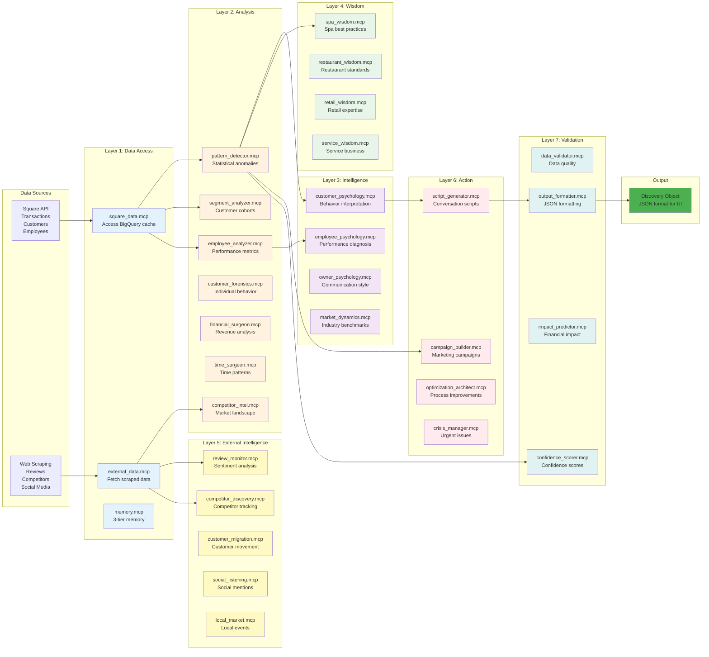
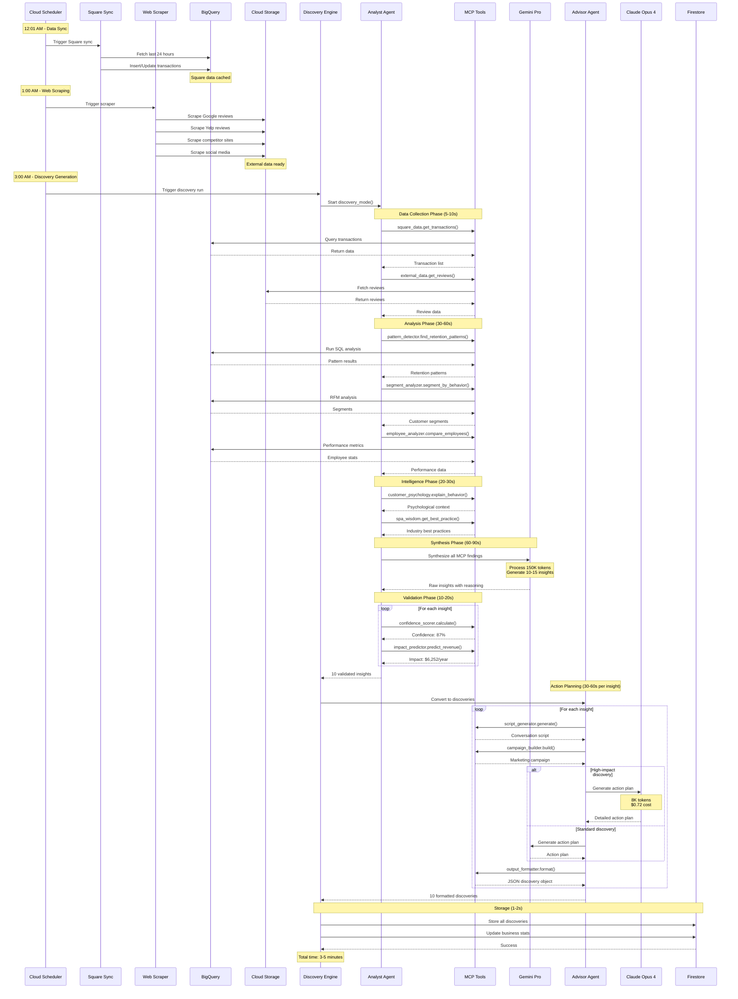
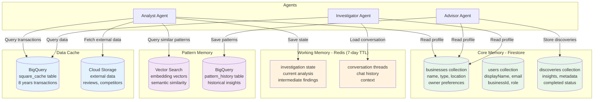
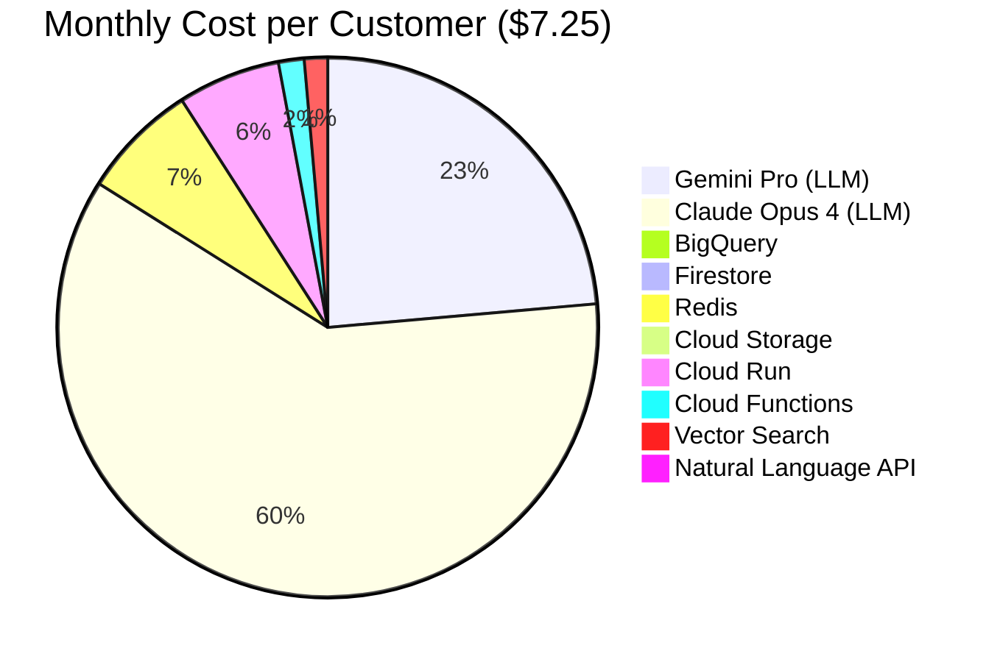
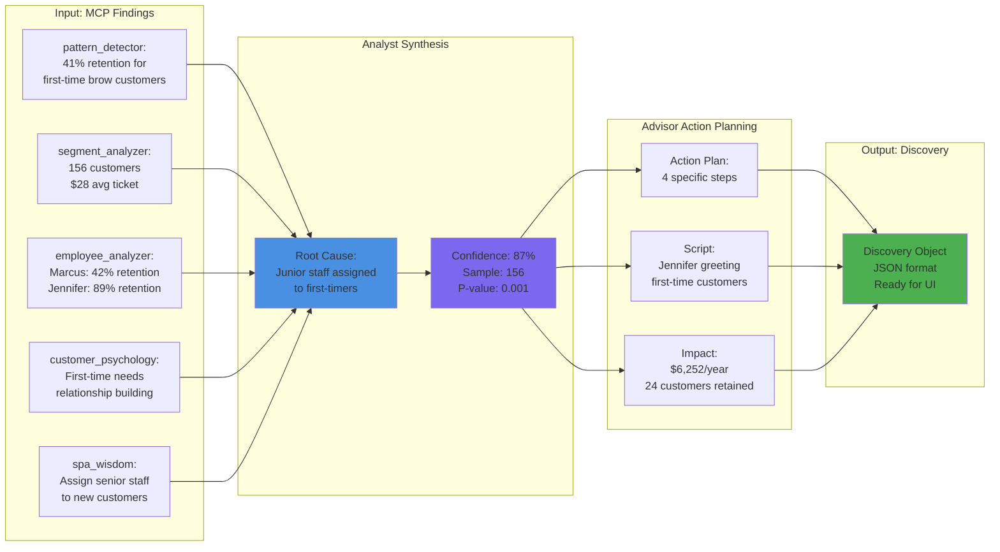
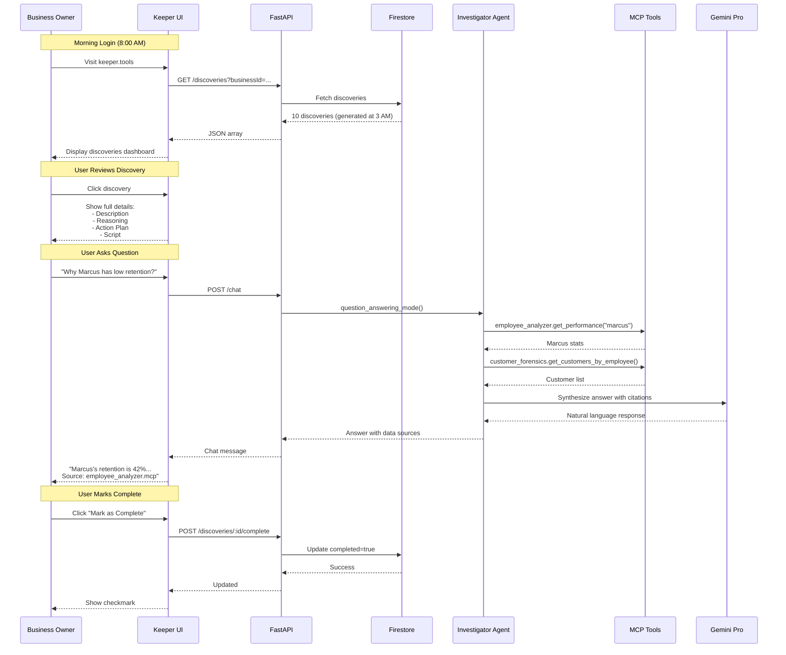

# Keeper Architecture - Mermaid Diagrams

This document contains visual architecture diagrams for the Keeper AI system.

## 1. High-Level System Architecture

```mermaid
graph TB
    subgraph "User Layer"
        UI[Keeper UI<br/>Nuxt 3 Frontend]
    end

    subgraph "API Gateway - Cloud Run"
        API[FastAPI REST API<br/>- GET /discoveries<br/>- POST /chat<br/>- POST /complete]
    end

    subgraph "Discovery Engine - Cloud Run"
        DE[Discovery Service<br/>Runs nightly at 3 AM]

        subgraph "3 Orchestrator Agents"
            ANALYST[Analyst Agent<br/>Deep Investigation]
            ADVISOR[Advisor Agent<br/>Action Planning]
            INVESTIGATOR[Investigator Agent<br/>Chat Handler]
        end
    end

    subgraph "31 MCP Tools"
        subgraph "Layer 1: Data Access"
            MCP1[square_data.mcp]
            MCP2[external_data.mcp]
            MCP3[memory.mcp]
        end

        subgraph "Layer 2: Analysis"
            MCP4[pattern_detector.mcp]
            MCP5[segment_analyzer.mcp]
            MCP6[employee_analyzer.mcp]
            MCP7[customer_forensics.mcp]
            MCP8[financial_surgeon.mcp]
            MCP9[time_surgeon.mcp]
            MCP10[competitor_intel.mcp]
        end

        subgraph "Layer 3: Intelligence"
            MCP11[customer_psychology.mcp]
            MCP12[employee_psychology.mcp]
            MCP13[owner_psychology.mcp]
            MCP14[market_dynamics.mcp]
        end

        subgraph "Layer 4: Wisdom"
            MCP15[spa_wisdom.mcp]
            MCP16[restaurant_wisdom.mcp]
            MCP17[retail_wisdom.mcp]
            MCP18[service_wisdom.mcp]
        end

        subgraph "Layer 5: External Intelligence"
            MCP19[review_monitor.mcp]
            MCP20[competitor_discovery.mcp]
            MCP21[customer_migration.mcp]
            MCP22[social_listening.mcp]
            MCP23[local_market.mcp]
        end

        subgraph "Layer 6: Action"
            MCP24[script_generator.mcp]
            MCP25[campaign_builder.mcp]
            MCP26[optimization_architect.mcp]
            MCP27[crisis_manager.mcp]
        end

        subgraph "Layer 7: Validation"
            MCP28[data_validator.mcp]
            MCP29[confidence_scorer.mcp]
            MCP30[impact_predictor.mcp]
            MCP31[output_formatter.mcp]
        end
    end

    subgraph "Data Storage - GCP"
        BQ[(BigQuery<br/>Square Cache<br/>Pattern History)]
        FS[(Firestore<br/>Discoveries<br/>Business Profiles)]
        REDIS[(Redis<br/>Working Memory<br/>7-day TTL)]
        GCS[(Cloud Storage<br/>External Data<br/>Scraped Content)]
        VS[(Vector Search<br/>Pattern Embeddings)]
    end

    subgraph "AI/ML Services"
        GEMINI[Vertex AI<br/>Gemini Pro<br/>$1.69/month]
        CLAUDE[Anthropic API<br/>Claude Opus 4<br/>$4.32/month]
    end

    subgraph "Data Pipeline"
        SYNC[Square Sync<br/>12:01 AM daily]
        SCRAPER[Web Scraper<br/>Playwright<br/>1:00 AM daily]
    end

    subgraph "Orchestration"
        SCHEDULER[Cloud Scheduler]
        PUBSUB[Pub/Sub]
    end

    %% User interactions
    UI -->|HTTPS| API
    API -->|Fetch| FS
    API -->|Chat| INVESTIGATOR

    %% Nightly discovery flow
    SCHEDULER -->|Trigger| PUBSUB
    PUBSUB -->|Invoke| DE
    DE --> ANALYST
    ANALYST -->|Insights| ADVISOR
    ADVISOR -->|Discoveries| FS

    %% Agents use MCPs
    ANALYST -.->|Uses| MCP1
    ANALYST -.->|Uses| MCP4
    ANALYST -.->|Uses| MCP11
    ANALYST -.->|Uses| MCP19
    ADVISOR -.->|Uses| MCP24
    ADVISOR -.->|Uses| MCP28
    INVESTIGATOR -.->|Uses| MCP1

    %% Agents use LLMs
    ANALYST -->|Synthesis| GEMINI
    ANALYST -->|High-impact| CLAUDE
    ADVISOR -->|Generation| GEMINI
    ADVISOR -->|Critical| CLAUDE
    INVESTIGATOR -->|Chat| GEMINI

    %% MCPs access data
    MCP1 --> BQ
    MCP2 --> GCS
    MCP3 --> FS
    MCP3 --> REDIS
    MCP3 --> VS
    MCP4 --> BQ
    MCP5 --> BQ

    %% Data pipeline
    SCHEDULER -->|12:01 AM| SYNC
    SCHEDULER -->|1:00 AM| SCRAPER
    SYNC -->|Insert| BQ
    SCRAPER -->|Upload| GCS

    style ANALYST fill:#4A90E2
    style ADVISOR fill:#7B68EE
    style INVESTIGATOR fill:#50C878
    style GEMINI fill:#FFD700
    style CLAUDE fill:#FF6B6B
```

## 2. MCP Layer Organization

## 3. Nightly Discovery Flow (Sequence Diagram)

## 4. Agent Architecture

```mermaid
graph TB
    subgraph "Analyst Agent - Deep Investigation"
        A1[discovery_mode<br/>Nightly analysis]
        A2[drill_down_mode<br/>User deep dive]
        A3[validation_mode<br/>Verify insights]
    end

    subgraph "Advisor Agent - Action Planning"
        B1[action_planning_mode<br/>Generate action plans]
        B2[script_writing_mode<br/>Create scripts]
        B3[campaign_mode<br/>Design campaigns]
        B4[crisis_mode<br/>Handle urgencies]
    end

    subgraph "Investigator Agent - Chat Interface"
        C1[question_answering_mode<br/>Handle queries]
        C2[investigation_mode<br/>Deep dive topics]
        C3[explanation_mode<br/>Explain discoveries]
    end

    subgraph "MCP Access"
        D1[Data Access MCPs<br/>square_data, external_data, memory]
        D2[Analysis MCPs<br/>7 analysis tools]
        D3[Intelligence MCPs<br/>4 intelligence tools]
        D4[Action MCPs<br/>4 action tools]
        D5[Validation MCPs<br/>4 validation tools]
    end

    subgraph "LLM Services"
        E1[Vertex AI Gemini Pro<br/>Standard synthesis]
        E2[Claude Opus 4<br/>High-impact discoveries]
    end

    A1 --> D1
    A1 --> D2
    A1 --> D3
    A1 --> E1
    A1 --> E2

    B1 --> D4
    B1 --> D5
    B1 --> E1
    B1 --> E2

    C1 --> D1
    C1 --> D2
    C1 --> E1

    style A1 fill:#4A90E2
    style A2 fill:#4A90E2
    style A3 fill:#4A90E2
    style B1 fill:#7B68EE
    style B2 fill:#7B68EE
    style B3 fill:#7B68EE
    style B4 fill:#7B68EE
    style C1 fill:#50C878
    style C2 fill:#50C878
    style C3 fill:#50C878
```

## 5. Data Storage Architecture

## 6. Cost Breakdown

## 7. Discovery Example Flow

## 8. User Interaction Flow

## Notes

- All diagrams use Mermaid syntax and can be rendered in GitHub, GitLab, or any Mermaid-compatible viewer
- Color coding:
  - **Blue**: Analyst Agent (investigation)
  - **Purple**: Advisor Agent (action planning)
  - **Green**: Investigator Agent (chat), Output/Success states
  - **Yellow**: LLMs, External Intelligence
  - **Red**: Action/Crisis Management
  - **Light colors**: Different MCP layers
